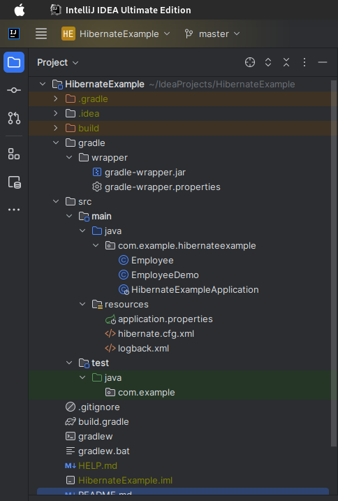
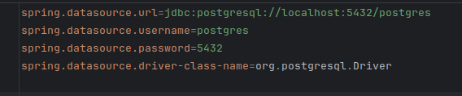
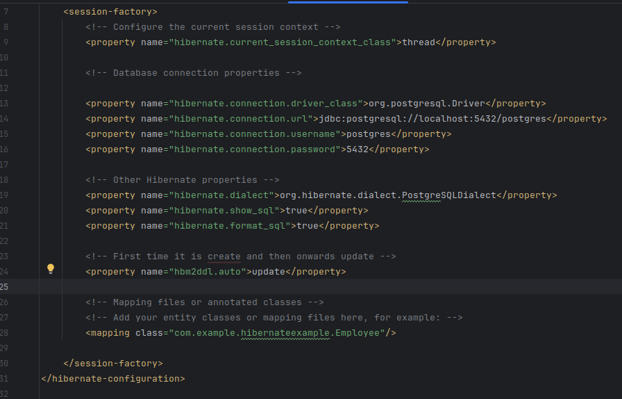

# HibernateExample

``` java
package com.example.hibernateexample;

import org.springframework.boot.SpringApplication;
import org.springframework.boot.autoconfigure.SpringBootApplication;

@SpringBootApplication
public class HibernateExampleApplication {

    public static void main(String[] args) {
        SpringApplication.run(HibernateExampleApplication.class, args);
    }
}
```

Это точка входа для вашего приложения Spring Boot,
и она отвечает за инициализацию и запуск приложения
Spring Boot.

Этот класс обычно используется, когда вы
хотите запустить веб-приложение Spring Boot.

Здесь прописан void main(String[] args

@SpringBootApplication — это аннотация,
указывающая, что это приложение Spring Boot.

```java
package com.example.hibernateexample;

import org.hibernate.Session;
import org.hibernate.SessionFactory;
import org.hibernate.cfg.Configuration;

import org.slf4j.Logger;
import org.slf4j.LoggerFactory; // Импорт библиотеки для логирования


import java.util.List;

public class EmployeeDemo {
    private static final Logger logger = LoggerFactory.getLogger(EmployeeDemo.class);

    public static void main(String[] args) {
        Session session = null;
        try {
            logger.info("This is an info log message");
            // Создаем фабрику сессий Hibernate
            SessionFactory factory = new Configuration()
                    .configure("hibernate.cfg.xml") // указываем файл конфигурации Hibernate
                    .addAnnotatedClass(Employee.class) // добавляем класс Employee как сущность Hibernate
                    .buildSessionFactory();

            // Создаем сессию Hibernate
            session = factory.openSession();

            // Создаем объект Employee
            Employee employee = new Employee("John", "Doe", "john.doe@example.com");

            // Начинаем транзакцию
            session.beginTransaction();

            // Сохраняем сотрудника в базе данных
            session.save(employee);

            // Запрос всех сотрудников из базы данных
            List<Employee> employees = session.createQuery("FROM Employee", Employee.class).list();

            for (Employee employeew : employees) {
                System.out.println(employeew);
            } // Вывод информации о сотруднике
            
            // Завершаем транзакцию
            session.getTransaction().commit();

            System.out.println("Сотрудник успешно сохранен в базе данных.");
        } catch (Exception e) {
            e.printStackTrace();
        } finally {
            if (session != null) {
                session.close(); // Закрытие сессии Hibernate в блоке finally для освобождения ресурсов
            }
        }
    }
}

```
### Зачем нужен Logger в коде?

Logger используется для логирования информации о ходе выполнения программы. Он позволяет записывать сообщения, которые могут пригодиться при отладке и мониторинге приложения. В данном случае, используется библиотека SLF4J (Simple Logging Facade for Java) с Logback в качестве реализации для логирования информационного сообщения в строке logger.info("This is an info log message");.
### Почему есть еще один метод public static void main(String[] args)?

Этот метод main в классе EmployeeDemo является вторичным и выполняется внутри вашего приложения Hibernate. Он нужен для демонстрации использования Hibernate для сохранения сотрудника в базе данных и чтения его оттуда. Это не главный метод main, который запускается при запуске приложения, а скорее часть кода для иллюстрации работы с Hibernate.
### Есть ли альтернативы для LoggerFactory?

Да, существуют альтернативы для LoggerFactory в Java. Например, вы можете использовать библиотеки java.util.logging (java.util.logging.Logger) или Log4j (org.apache.log4j.Logger). Выбор зависит от ваших предпочтений и требований к логированию в вашем проекте. SLF4J часто используется, так как он предоставляет абстракцию над различными реализациями логирования, что облегчает переключение между ними при необходимости.

session = factory.openSession(); - это строка кода, которая создает объект сессии Hibernate. Давайте подробнее разберем, как это работает изнутри:

### Что такое SessionFactory?
SessionFactory: factory - это экземпляр SessionFactory, который представляет собой фабрику сессий Hibernate. Фабрика сессий является ключевым компонентом в Hibernate и отвечает за создание сессий.

Создание сессии: factory.openSession(); вызывает метод openSession() на экземпляре SessionFactory. Этот метод создает новую сессию для взаимодействия с базой данных.

Сессия Hibernate: Сессия представляет собой временный контекст взаимодействия с базой данных. Она обеспечивает следующие функции:

Управление жизненным циклом объектов (например, сохранение, загрузка, обновление, удаление объектов).
Выполнение запросов к базе данных.
Управление транзакциями.
Использование сессии: После создания сессии, вы можете использовать ее для выполнения операций с базой данных. В вашем коде, сессия используется для сохранения объекта Employee в базе данных и выполнения запроса session.createQuery("FROM Employee", Employee.class).list(); для извлечения списка сотрудников.

Завершение сессии: После выполнения операций с базой данных, сессия должна быть закрыта с помощью session.close(); для освобождения ресурсов и завершения временного контекста.

Таким образом, строка session = factory.openSession(); создает сессию, с которой можно взаимодействовать с базой данных при использовании Hibernate.

### Зачем нужен Hibernate?

Hibernate - это фреймворк для объектно-реляционного отображения (ORM), и его основная цель - упростить взаимодействие между Java-приложениями и реляционными базами данных. Вот некоторые из его основных преимуществ и зачем он нужен:

Объектно-реляционное отображение: Hibernate позволяет разработчикам работать с базой данных, используя объекты Java, вместо SQL-запросов. Это снижает сложность и позволяет более натурально моделировать данные приложения.

Кросс-платформенность: Hibernate поддерживает множество реляционных баз данных, что позволяет разрабатывать приложения, которые могут быть развернуты на разных СУБД без изменений в коде.

Управление жизненным циклом объектов: Hibernate позволяет управлять объектами приложения и их состоянием в рамках сессий. Он автоматически отслеживает изменения и позволяет сохранять, обновлять и удалять объекты с минимумом кода.

Производительность: Hibernate предоставляет множество оптимизаций и кэширования для улучшения производительности запросов к базе данных.

Язык запросов HQL: Hibernate Query Language (HQL) - это объектно-ориентированный язык запросов, подобный SQL, но работающий с объектами Java. Он позволяет выполнять запросы к базе данных, используя объекты и атрибуты, а не таблицы и столбцы.

Расширяемость: Hibernate можно настроить и расширить, чтобы соответствовать специфическим требованиям приложения.

### Что такое ORM?? Какие есть?

ORM (Object-Relational Mapping) - это программная технология, которая позволяет разработчикам работать с данными в реляционных базах данных с использованием объектно-ориентированных концепций. Она упрощает взаимодействие между приложением, написанным на языке программирования (например, Java, C#, Python), и реляционной базой данных, где данные хранятся в таблицах. ORM преобразует данные из таблиц в объекты и наоборот, что позволяет разработчикам работать с данными в более удобной и объектно-ориентированной форме.

Существует несколько ORM-фреймворков, разработанных для разных языков программирования. Некоторые из наиболее популярных ORM-фреймворков включают:

Hibernate: Это ORM-фреймворк для языка Java. Он позволяет разработчикам создавать Java-объекты, которые мапятся на таблицы в реляционной базе данных. Hibernate предоставляет множество функций для управления жизненным циклом объектов и выполнения запросов к базе данных.

Entity Framework: Это ORM-фреймворк для языка C# и платформы .NET. Он обеспечивает сопоставление объектов с таблицами в базе данных и предоставляет LINQ (Language-Integrated Query) для выполнения запросов.

Django ORM: Это ORM-фреймворк, встроенный в веб-фреймворк Django для Python. Он позволяет разработчикам определять модели данных в Python и автоматически создавать схему базы данных.

SQLAlchemy: Это ORM-фреймворк для Python, который предоставляет более низкоуровневый способ взаимодействия с базой данных, чем Django ORM. Он также поддерживает SQL-выражения.

Doctrine: Это ORM-фреймворк для PHP, который используется во многих PHP-проектах, таких как Symfony.

Ruby on Rails ActiveRecord: Это ORM-фреймворк для Ruby, встроенный в Ruby on Rails. Он обеспечивает простой способ создания моделей данных и выполнения запросов.

ORM упрощает разработку приложений, так как разработчику не нужно писать SQL-запросы вручную и следить за деталями взаимодействия с базой данных. Вместо этого, разработчик может работать с объектами и использовать объектно-ориентированные методы и свойства для доступа к данным в базе данных.


### application.properties
Эти настройки являются конфигурацией для подключения к базе данных PostgreSQL в приложении, которое использует Spring Framework. Давайте разберем каждую строку по-отдельности:

spring.datasource.url=jdbc:postgresql://localhost:5432/postgres: Эта строка определяет URL-адрес (Uniform Resource Locator) базы данных. В данном случае, мы используем протокол JDBC (Java Database Connectivity) для взаимодействия с базой данных PostgreSQL, указываем хост (localhost) и порт (5432), а также имя базы данных (postgres), к которой приложение будет подключаться.

spring.datasource.username=postgres: Здесь указывается имя пользователя для подключения к базе данных PostgreSQL. В данном случае, это имя пользователя "postgres".

spring.datasource.password=5432: Эта строка определяет пароль, необходимый для аутентификации при подключении к базе данных. Пароль указан как "5432", но это, вероятно, ошибка, так как пароль обычно является секретным значением, и его не следует публично раскрывать. Вам следует заменить "5432" на фактический пароль для пользователя "postgres".

spring.datasource.driver-class-name=org.postgresql.Driver: Здесь указывается полное имя класса JDBC-драйвера для PostgreSQL. Этот драйвер используется Spring для взаимодействия с базой данных PostgreSQL. Класс org.postgresql.Driver является драйвером JDBC для PostgreSQL.

Эти настройки позволяют вашему приложению знать, как подключиться к базе данных PostgreSQL, и обеспечивают необходимую информацию для установления соединения.



Этот файл является конфигурационным файлом Hibernate, который определяет настройки и параметры для работы Hibernate в вашем приложении. Давайте разберем его построчно:

```javascript

<hibernate-configuration>: 
Начало корневого элемента конфигурации Hibernate.

<session-factory>: 
Этот элемент содержит настройки для фабрики сессий Hibernate. 
Фабрика сессий отвечает за создание и управление сессиями Hibernate.

<property name="hibernate.current_session_context_class">thread</property>: 
Эта строка определяет текущий контекст сессии Hibernate как "thread". 
Это означает, что сессия будет ассоциирована с текущим потоком выполнения.

<property name="hibernate.connection.driver_class">org.postgresql.Driver</property>: 
Здесь указывается класс JDBC-драйвера для PostgreSQL.

<property name="hibernate.connection.url">jdbc:postgresql://localhost:5432/postgres</property>: 
Эта строка определяет URL-адрес базы данных PostgreSQL, 
к которой Hibernate будет подключаться.

<property name="hibernate.connection.username">postgres</property>: 
Имя пользователя, используемое для подключения к базе данных PostgreSQL.

<property name="hibernate.connection.password">5432</property>: 
Пароль, необходимый для аутентификации при подключении к базе данных. 
Обратите внимание, что пароль обычно не указывается в открытом виде в 
конфигурационных файлах из-за соображений безопасности.

<property name="hibernate.dialect">org.hibernate.dialect.PostgreSQLDialect</property>: 
Указывается диалект базы данных PostgreSQL, который Hibernate будет 
использовать для генерации SQL-запросов.

<property name="hibernate.show_sql">true</property>: 
Если значение установлено как "true", Hibernate будет выводить SQL-запросы, 
которые он выполняет, в журнал.

<property name="hibernate.format_sql">true</property>: 
Если значение установлено как "true", Hibernate будет форматировать 
вывод SQL-запросов для лучшей читаемости.

<property name="hbm2ddl.auto">update</property>: 
Эта строка определяет, как Hibernate будет обновлять схему базы данных. 
Значение "update" означает, что Hibernate будет автоматически обновлять 
схему на основе изменений в классах сущностей.

<mapping class="com.example.hibernateexample.Employee"/>: 
Этот элемент указывает Hibernate на класс сущности, который 
он должен использовать для маппинга данных между объектами 
Java и таблицами базы данных. В данном случае, это класс com.example.hibernateexample.Employee.

Этот файл конфигурации Hibernate определяет основные 
параметры подключения к базе данных, диалект SQL, и классы, 
которые должны быть сопоставлены с таблицами базы данных.